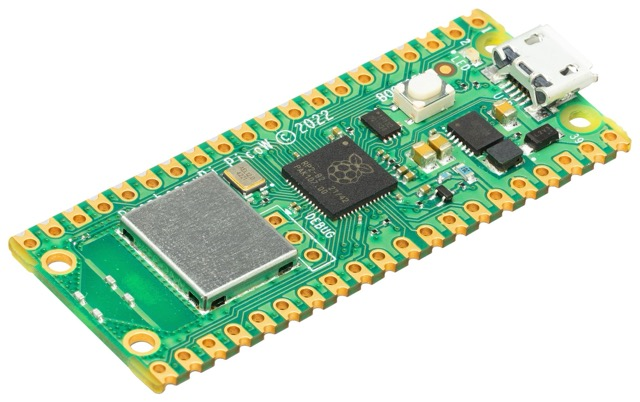
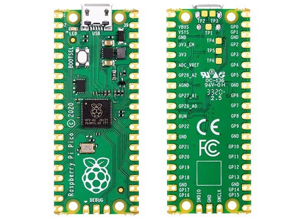
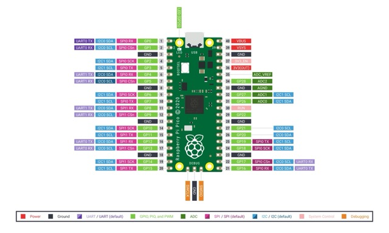
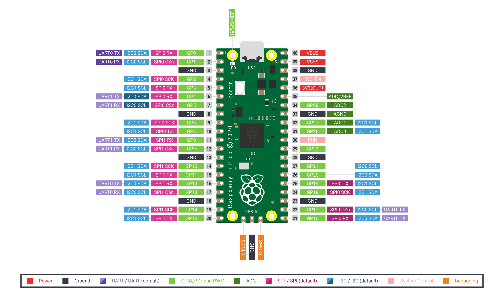

# Proyecto: Gadget Estación Meteorológica con Raspberry Pi Pico

Este Proyecto es el código para un gadget con el que monitorizar la calidad
del aire en una oficina/habitación mostrando por pantalla los valores.
Los datos mostrados son:

- Temperatura
- Humedad
- Presión
- Calidad del aire
- CO2 ppm
- tVOC ppb
- Luz
- UV
- Ruido ambiente

Sitio web del autor: [https://raupulus.dev](https://raupulus.dev)

Repository [https://gitlab.com/raupulus/rpi-pico-gadget-weatherstation](https://gitlab.com/raupulus/rpi-pico-gadget-weatherstation)

El funcionamiento es el siguiente:

- Se realiza una lectura de todos los sensores
- Los valores actuales son actualizados para mostrarse en la pantalla
- Si ha pasado más de un minuto, se subirá a la api en caso de tener el wifi
  configurado y la api habilitada en las variables de entorno
- Se hace una pequeña pausa y vuelta a empezar.

Puedes configurar algunos parámetros básicos en el archivo de variables de
entorno que usamos como base **.env.example.py** cuando lo copies a env.py

  
  
  
  

## Contenido del Repositorio

- **assets/**: Imágenes fuente diseñadas por mi con los iconos de la
  pantalla, estas imágenes están en bmp y algunas en krita para convertirlas
  mediante un script al formato de la pantalla.
- **docs/**: Documentación adicional, esquemas y guías de instalación.
- **src/**: Código fuente del proyecto.
- **src/images**: Iconos utilizados en la pantalla, formato rgb565 16 bits.
- **src/Models**: Modelos/Clases para separar entidades que intervienen.
- **src/font5x7**: Tipografía para la pantalla con 5x7px.

## Instalación

1. **Instalación de MicroPython:**
    - Asegúrate de que MicroPython esté instalado en tu Raspberry Pi Pico.
      Puedes seguir las instrucciones en
      la [documentación oficial](https://docs.micropython.org/en/latest/rp2/quickref.html).
      He utilizado para el
      proyecto [MicroPython 1.24](https://micropython.org/download/rp2-pico/)

2. **Cargar el Código:**
    - Descarga o clona este repositorio.
    - Copia el archivo *.env.example.py* a *env.py* y rellena los datos para
      conectar al wireless además de la ruta para subir datos a tu API.
      Puedes configurar ahí el tiempo de apagado en pantalla también.
    - Copia los archivos de la carpeta `src/` a la raíz de la Raspberry Pi Pico.

---

## Modelo para la caja 3D

Puedes descargar mi diseño para este proyecto desde cualquiera de los siguientes
perfiles:

- Thingiverse: WIP -> Subida pendiente al concluir el proyecto por si hay 
  modificaciones
- Printables: WIP -> Subida pendiente al concluir el proyecto por si hay 
  modificaciones
- Makerworld: WIP -> Subida pendiente al concluir el proyecto por si hay 
  modificaciones

---

A continuación tienes la descripción de los elementos utilizados en esta 
estación meteorológica con Raspberry Pi Pico y MicroPython. 

He añadido las descripciones de cada sensor, cómo funcionan y el
pinout detallado de cada uno.

## Sensores utilizados

### Sensor Bosch BME680

El **BME680** es un sensor ambiental avanzado fabricado por Bosch que mide
cuatro parámetros clave: temperatura, presión atmosférica, humedad relativa y
calidad del aire. 

Es una excelente opción para proyectos de monitoreo ambiental,
ya que proporciona información precisa sobre las condiciones del entorno en un
solo dispositivo. Este sensor se comunica a través del bus I2C y tiene una
resolución de 16 bits para la medición de temperatura y presión, lo que
garantiza lecturas bastante precisas.

- **Temperatura**: Rango de -40°C a +85°C.
- **Presión**: Rango de 300 a 1100 hPa.
- **Humedad**: Rango de 0 a 100%.
- **Calidad del aire (IAQ)**: Medida como un índice que combina la detección de
  gases volátiles.

#### Tabla de conexiones:

| Pin Raspberry Pi Pico | Pin Sensor BME680 |
|-----------------------|-------------------|
| **SDA (14)**          | SDA               |
| **SCL (15)**          | SCL               |
| **VCC (3.3V)**        | VCC               |
| **GND**               | GND               |

- **Dirección I2C**: 0x77 (predeterminada)

---

### Sensor BH1750

El **BH1750** es un sensor digital de luz ambiente que mide la intensidad de la
luz en lux. Utiliza el protocolo I2C para la comunicación y tiene una precisión
bastante buena para aplicaciones generales de medición de luz. Es ideal para
proyectos donde se desee saber la cantidad de luz ambiental para ajustar el
brillo de pantallas, controlar sistemas automáticos de iluminación o realizar
análisis de luminosidad.

- **Rango de medición**: 1 lux a 65535 lux.
- **Resolución**: 1 lux.

#### Tabla de conexiones:

| Pin Raspberry Pi Pico | Pin Sensor BH1750 |
|-----------------------|-------------------|
| **SDA (14)**          | SDA               |
| **SCL (15)**          | SCL               |
| **VCC (3.3V)**        | VCC               |
| **GND**               | GND               |

- **Dirección I2C**: 0x23 (predeterminada)

---

### Sensor VEML6070

El **VEML6070** es un sensor UV que mide la radiación ultravioleta (UV). Es
ideal para proyectos que requieren monitoreo de la exposición a la luz solar y
sus efectos, como estaciones meteorológicas o sistemas de alerta de radiación
solar. Este sensor es capaz de medir la luz UV-A y UV-B y tiene dos direcciones
I2C para la lectura de datos de la radiación.

- **Rango de medición**: 0 a 15 mW/cm².
- **Resolución**: 0.001 mW/cm².

#### Tabla de conexiones:

| Pin Raspberry Pi Pico | Pin Sensor VEML6070 |
|-----------------------|---------------------|
| **SDA (14)**          | SDA                 |
| **SCL (15)**          | SCL                 |
| **VCC (3.3V)**        | VCC                 |
| **GND**               | GND                 |

- **Direcciones I2C**:
    - 0x39 (escritura)
    - 0x38 (lectura byte bajo)
    - 0x39 (lectura byte alto)

---

### Sensor CJMCU-811

El **CJMCU-811** es un sensor de gases que mide dos parámetros importantes en la
calidad del aire: **CO2** (dióxido de carbono) y **TVOC** (compuestos orgánicos
volátiles totales). Este sensor es útil para detectar la contaminación del aire
y el nivel de calidad del aire interior, por lo que es ideal para aplicaciones
de monitoreo en espacios cerrados.

- **Rango de medición**:
    - CO2: 400 a 8192 ppm.
    - TVOC: 0 a 1187 ppb.

#### Tabla de conexiones:

| Pin Raspberry Pi Pico | Pin Sensor CJMCU-811 |
|-----------------------|----------------------|
| **SDA (4)**           | SDA                  |
| **SCL (5)**           | SCL                  |
| **VCC (3.3V)**        | VCC                  |
| **GND**               | GND                  |

- **Dirección I2C**: 0x5A (predeterminada)

---

### Micrófono MAX9814

El **MAX9814** es un micrófono con amplificación de audio que tiene salida
analógica. Permite la captación de sonidos en el entorno y puede ser usado para
detectar ruidos, sonidos o como parte de sistemas de monitoreo acústico. Su
salida analógica puede ser conectada directamente a la entrada ADC (convertidor
analógico a digital) de la Raspberry Pi Pico para ser procesada en el software.

#### Tabla de conexiones:

| Pin Raspberry Pi Pico | Pin Micrófono MAX9814 |
|-----------------------|-----------------------|
| **ADC (26)**          | OUT                   |
| **VCC (3.3V)**        | VCC                   |
| **GND**               | GND                   |

---

## Pantalla ST7735 128x160px 1,8"

La **pantalla ST7735** es una pantalla a color con resolución de 128x160 píxeles
y tamaño de 1,8". Aunque es una pantalla de bajo costo y relativamente lenta en
comparación con otras pantallas más avanzadas, cumple perfectamente su función
en proyectos de bajo presupuesto, como este, donde no se requiere una tasa de
refresco alta ni una gran resolución para mostrar datos. La comunicación con la
Raspberry Pi Pico se realiza a través del bus SPI, lo que la hace bastante
eficiente en cuanto a tiempo de respuesta.

#### Tabla de conexiones:

| Pin Raspberry Pi Pico | Pin Pantalla ST7735 |
|-----------------------|---------------------|
| **RESET (9)**         | RESET               |
| **CE (13)**           | CE                  |
| **DC/A0 (12)**        | DC                  |
| **VCC (3.3V)**        | VCC                 |
| **BL (3)**            | Led (backlight)     |
| **SCK (10)**          | SCK (Serial Clock)  |
| **MOSI/SDA (11)**     | MOSI (Data)         |
| **VCC (3.3V)**        | VCC                 |
| **GND**               | GND                 |

---

## LEDs indicadores de estado

Los LEDs indicadores de estado permiten visualizar en tiempo real el estado del
sistema y el proceso en el que se encuentra. Estos LEDs proporcionan una
retroalimentación visual clara, lo que facilita la monitorización del
funcionamiento de la estación meteorológica.

#### Tabla de conexiones:

| Pin Raspberry Pi Pico | LED indicador             |
|-----------------------|---------------------------|
| **Pin 20**            | LED encendido correcto    |
| **Pin 21**            | LED lectura de sensores   |
| **Pin 22**            | LED subida de datos a API |

---

## Esquema de la raspberry pi pico

## Licencia

Este proyecto está licenciado bajo la Licencia GPLv3. Consulta el archivo
LICENSE para más detalles.